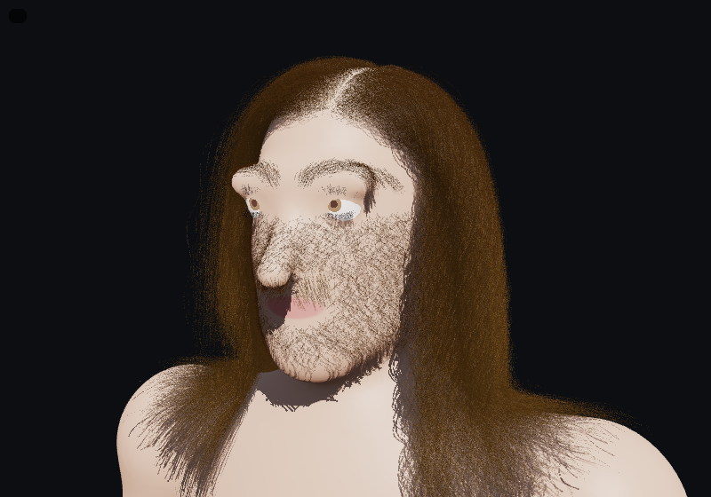

# hair



A procedural, parametric, real-time strand hair system on **WebGPU** (via **TypeGPU**), aiming for **120 fps**.
It covers a full-body hair atlas, which you can groom, cut, shave and style, and run fingers through.

```
npm install
npm run dev        # http://localhost:5173 — needs a WebGPU browser (Chrome/Edge 113+, Safari 26+, Firefox 141+)
npm test           # unit tests (mesher, scattering, shader resolution, geometry)
npm run typecheck
```

## What's in it

- **Procedural mannequin.** The body is a smooth union of analytic primitives (signed distance field). It is
  meshed at startup by a narrow-band surface-nets mesher. The same primitive list generates the WGSL collision
  SDF, so rendering, root placement and physics agree.
- **Full-body hair atlas** (`src/groom/atlas.ts`). Scalp (hairline, temporal recession, crown whorl, part line,
  fringe, pattern hair loss), eyebrows, upper and lower lashes, beard, mustache, chest, abdomen ("happy trail"),
  axillary, pubic, upper arms, forearms, hands, legs, feet, back, and vellus. Each region has a soft density
  mask, a flow field and parametric defaults. Character-wide controls cover androgen level, hair loss, part,
  whorl spin and seed.
- **Parametric hair model** (`src/groom/params.ts`):
  - Shape: density, length and variation, diameter, ellipticity, root lift, surface follow, volume.
  - Macro curl (simulated wave and helix) and micro coil (rendered coil with kink).
  - Andre Walker 1A–4C presets, frizz, flyaways, clumping.
  - Look: eumelanin and pheomelanin, grey fraction, dye, sun bleach, longitudinal and azimuthal roughness,
    cuticle tilt, IOR, wetness, oiliness.
  - Physics: bend stiffness, hold (gel), hold falloff, damping, gravity, friction.
- **GPU pipeline** (`src/gpu/wgsl/`). Each frame runs:
  - **Grow:** rest shapes are grown from roots along the skin with gravity and collision.
  - **Simulate:** guide strands, one thread each, use Verlet integration with TressFX-style local and global
    shape matching, follow-the-leader inextensibility with DFTL damping, and SDF and finger collision with
    friction.
  - **Expand:** every render strand is carried by its guide's frames, then clumping, coils, frizz, taper and
    finger contact correction are applied.
  - **Render:** a shadow map with hair transmittance, then Karis/Marschner R/TT/TRT shading on vertex-pulled
    ribbons, with stochastic MSAA coverage for sub-pixel strands.
- **Tools:**
  - **Scissors** cut where the brush crosses the strands.
  - **Clipper** trims to a guard length, which shaves at small guard values.
  - **Comb** is a displacement brush on the rest shape.
  - **Hand** is a row of finger capsules that rakes through the hair, with friction drag. Followers are
    corrected so they never cross a finger.

## Controls

| Input | Action |
|---|---|
| Right-drag / Shift+right-drag / wheel | Orbit / pan / zoom |
| Left-drag | Use the current tool |
| Shift+left-drag | Move the head (hair reacts) |
| `1`–`5` | Orbit, cut, clipper, comb, hand |
| `f` | Focus the camera on the point under the cursor |

URL parameters for debugging and benchmarking:

- `?density=0.3`
- `?regions=scalp,beard`
- `?pause`
- `?yaw=…&pitch=…&dist=…&tx=…&ty=…&tz=…`
- `?width=4` (ribbon width multiplier)
- `?tool=hand`

## Verification without a GPU

`scripts/screenshot.mjs` drives headless Chromium with SwiftShader WebGPU. It prints console errors and saves a
screenshot, which is useful for CI and for agents. Performance numbers from SwiftShader are meaningless; use a
real GPU and the on-screen GPU timings (timestamp queries).

```
npx vite --port 5173 &
CHROMIUM_PATH=/path/to/chrome VIEWPORT=640x400 node scripts/screenshot.mjs "http://localhost:5173/?density=0.2&regions=scalp&pause" out.png 20000
```

## Docs

- `AGENTS.md`: project goals, architecture, conventions and the agent and model policy.
- `docs/research/`: literature reviews on the hair atlas, real-time rendering, simulation and grooming, the
  TypeGPU 0.12 API, and finger/contact interaction.
